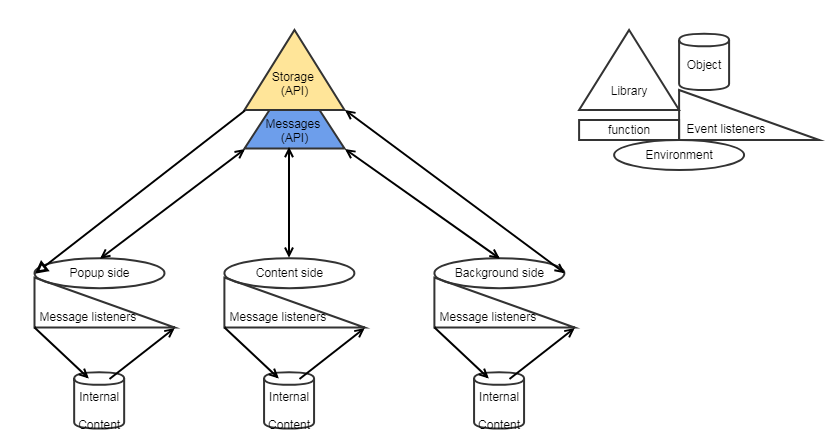

## Inter-extension API, documentation
(snipintext, super-selector)

---

### Description
An extension to: 
- create
- store
- use
- manage  

snippets used in text fields on web pages

#### Use Scenarios: 
##### CREATE, USE

1. select text input element on preferred web page, to use snippets in for.  
selection is made by super-selector extention. 
- start select action from a popup menu
- select text input element 
- it will broadcast data through chrome.message API: web page address and an element's path  
Snipintext extension will receive the message  
Content of an input element gets constantly monitored by injected script(by snipintext) after an element's selected 

2. Open creation menu, on specified page, using keyboard shortcut 
selected element temporarely turnsout into a console dialog 
- dialog
- creation, storage
input element gets back into a normal state. 

3. Enter created snippet key into an input element, it will be replaced with a specified replace text. 

##### MANAGE: add, update, group, regroup, import/export, delete

---

### API 

